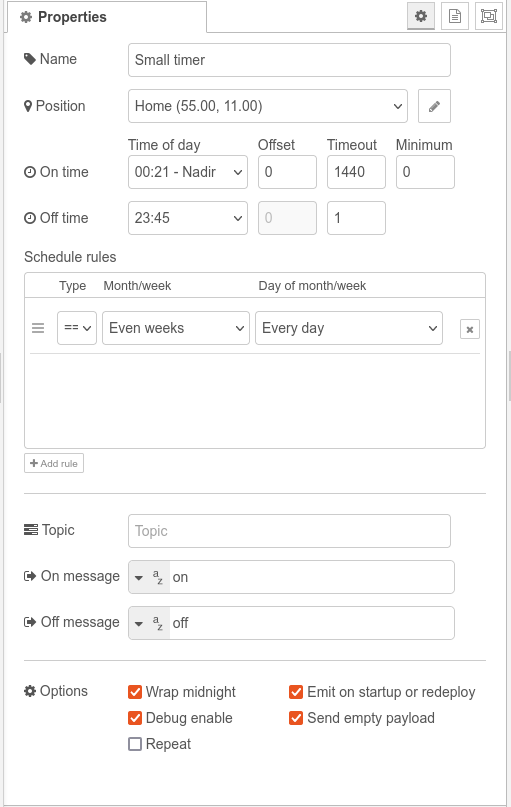

# Node-red-small-timer
[](https://sonarcloud.io/summary/new_code?id=tbowmo_node-red-small-timer)


A node-red timer node to rule them all. It delivers either an on or off message at scheduled intervals. These intervals can be consistent daily occurrences, like '19:00' for 'on' and '23:00' for 'off', perfect for controlling f.ex. a porch light. However, its true power lies in its ability to activate the light at, let's say sunset and deactivate it at dusk. Pretty cool, right?

This encapsulates the core concept: Emit a predefined message at either specific times, or on sunrise / sunset. Garnish this with a configurable day schedule, and you have a small timer for your lights, or other things that needs to be turned on or off daily.

# Install
Either use the palette manager in Node-RED to install the plugin, or use a terminal to install directly in your local installation of Node-RED:
```bash
npm install @tbowmo/node-red-small-timer
```

Once installed, restart your node-red server, and you will have a set of new nodes available in your palette under timers.

# Setup
<br>
Start by configuring a position, this is used to calculate the correct sunrise/sunset times for your area. You can either let your browser do it by pressing the button "Get position from browser" or use other means like Google Maps to find the latitude/longitude for your site.

## On and Off time
Configures the on and off events<br>


### Time of day
Set this property to the desired on / off time for the day. Can be a specific time, or use a dynamic time such as _sunrise_, _sunset_ etc.


_**Note!**_ the timestamps shown under "Dynamic sun and moon times" is calculated on the fly, by the suncalc library, and are shown for the location chosen and current time of year. The actual time used by small timer will be re-calculated regularly, if one of these event times are chosen

### Offset
When using a dynamic time, you can add an offset to the calculated time. Use it for example to turn the light on 30 minutes before sunrise.

### Timeout
Used when triggering an override of the current state, after set time the node will switch back to whatever the output state should be at the given time, if it was in auto mode. This value is split into an on and off timeout. This means that you could have an 5 minutes on timeout (for turning on lights momentarily) while keeping off at default timeout which is 24 hours (or until next state change)

### Minimum time
This can be used to set a minimum required 'on time'. If the calculated 'on time' is less than this value, the event will be ignored. For example, if you are using sunset to turn on lights in the evening with a fixed off time, you might not be interested in turning on the light for only 5 minutes. This can be prevented by setting a minimum 'on time' here.

## Schedule rules
<br>
This is used to determine which days the timer should or should not operate.

**==** is include, this specifies days where the rule should run

**!=** is exclude, this specifies days where the rule does _not_ run.

_Note_ that if the state is turned on by auto state, it will also run at the off time, even if the day is excluded (ie, if the off time is after midnight and the day is excluded).

The rules are read and executed one by one, it is the outcome after the last rule has been read, that defines if the day is included or excluded

If the node is turned on on a "do not run day", temporary on is used, and output will be turned off after set [timeout](#timeout)

_Default logic state is that the timer is disabled, so you need at least one rule that turns it on (**==**)._

### Month / week

Note that the weeks numbers are calculated according to ISO8601, which means that weeks start on mondays.

### Examples of schedule rules
1) Run on every day, except thursdays in July<br>


2) Run on mondays in odd weeks, except all of December<br>


## Output configuration
### Topic
Topic parameter of the msg that is sent out on events. This can be used to send on to mqtt for example.

### On message
Payload of the output message is set to this value during on, can be set to json, number, string, or boolean

### Off message
Payload of the output message is set to this value during off, can be set to json, number, string, or boolean

## Options
<br>
**Wrap midnight**: Will wrap `on time` around midnight, if `on time` is 23:00 and `off time` is 02:00, checking this will turn on before midnight, and off after. If unchecked, it will be ignored. This is particularly useful if you have a fixed `on time` at 06:00 in the morning, and a dynamic `off time` tracking sunrise, when the sunrise is before 06:00 you might not want it to turn on the porch light, and thus it should not wrap midnight.

**Emit on startup**: Configures the node to emit a message 2 seconds after startup / redeploy of your node red flow.

**Debug enable**: This will add an extra output to the node providing debug information, like the different sunrise/sunset etc. times (see [debug section below](#debug))

**Repeat**: Enables the node to repeat status messages with the specified interval (in seconds). If disabled the node will only emit a message when its state changes.

# Output

By default the node has a single output, which provides the following object:
```ts
{
    trigger: 'input' | 'timer',
    autoState: boolean,
    timeout: number,
    temporaryManual: boolean,
    duration: number,
    stamp: number,
    state: string,
    payload: object, string, number // as setup in the node
    topic: string // (as setup in the node)
}

```

| property        | description
|-----------------|-----------------------------------------------------------
| trigger         | if the output is triggered by an input message, then this property is set to "input" otherwise it is set to "timer"
| autoState       | will be true whenever the node is running in auto mode
| timeout         | indicates how long there is until the node will return to auto state, when in temporary override
| temporaryManual | Will be true when the node is in temporary override
| duration        | time until next on, or off, event happens
| state           | will be one of auto, tempOn or tempOff
| stamp           | current unix timestamp (since epoch)

# Input

The input of the node takes a few commands in the payload property of the message sent _to_ small timer, these are completely optional and not needed for normal operation, but can be used to turn the output temporary on or off.

| payload        | description
|----------------|--------------------------------------
| 1 / on         | Turns the output temporarily on
| 0 / off        | Turns the output temporarily off
| auto / default | Sets the node back to autostate, and outputs whatever the autostate would be (on/off)
| sync           | Emits the current state on the output

Using the temporary on/off feature will emit the respective on/off message on the output. Simultaneously, it will start an internal timer with the value from the [timeout](#timeout) configuration option. When this timer runs out, the node will resume auto mode.

Note that if you do a temporary on/off to the same state that the auto mode will be in, then the node will return to auto state.

Sending an auto/default payload will cause it to return to auto mode (if it was in a temporary on/off state earlier), and emit the new state if so required

**NOTE:** If the input payload property contains non-decodable properties/strings, the input will be ignored, and an error will be emitted to Node-RED.

## Optional properties on input message
| property | type    | description
|----------|---------|--------------------------------
| reset    | boolean | If this property resolves to a truthy value, the node will be reset to auto mode (Works like auto/default payload)
| timeout  | number  | This can be used to override the [timeout](#timeout) set in the configuration, and applies to the current on or off command. If left out / undefined, the configured timeout will be used

# Debug

When debug is enabled, the node will have a secondary output, which emits data from the suncalc calculations for sunrise/sunset, etc. This data will be emitted at the same time as the main output is emitted (at changes, or when sync is sent to the input).

The debug output will contain the following data
```ts
{
    override: 'tempOn' | 'tempOff' | 'auto',
    topic: 'debug'
    sunTimes: {
        dawn: number,
        dusk: number,
        solarNoon: number,
        sunrise: number,
        sunset: number,
        night: number,
        nightEnd: number,
    },
    moonTimes: {
        rise: number,
        set: number,
    },
    now: number,
    actualStart: number,
    actualEnd: number,
    nextStart: number,
    nextEnd: number,
    onState: boolean,
    operationToday: 'normal' | 'noMidnightWrap' | 'minimumOnTimeNotMet',
}
```
All the above numbers will represent the number of minutes since midnight on the day the event happens, except for nextStart and nextEnd, which will indicate the number of minutes until the next event.

The debug object can be extended with new properties in future releases that might not be fully described here.
